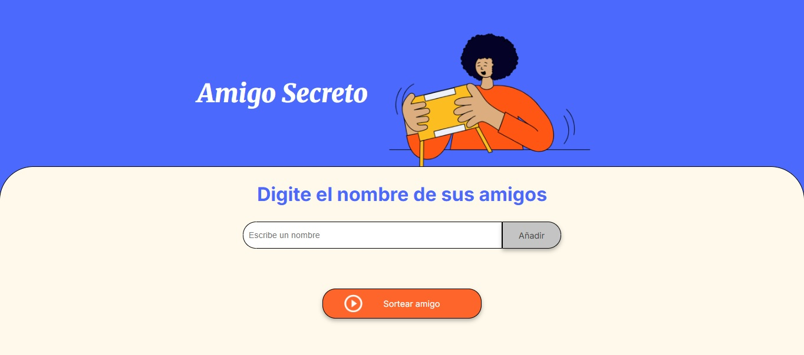
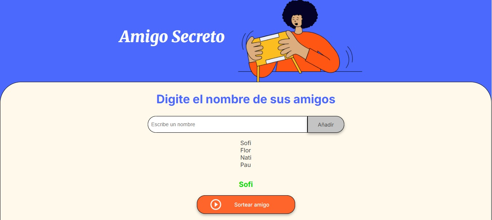

<h1> challenge amigo secreto</h1>

# 🎁 Challenge Amigo Secreto
Este proyecto es parte del curso de **Alura Latam**.  
Consiste en una aplicación sencilla en **JavaScript** que permite organizar un sorteo de "Amigo Secreto".
---
## 🚀 Funcionalidades
- Agregar nombres de participantes.
- Evitar que se repitan nombres.
- Realizar el sorteo de manera aleatoria.
- Mostrar el resultado en pantalla.
---
## 🛠️ Tecnologías utilizadas
- HTML
- CSS
- JavaScript
---
## 📸 Capturas de pantalla
### Pantalla principal


### Resultado del sorteo

---
## ▶️ Cómo usarlo
1. Clona este repositorio:
   ```bash
   git clone 
---
👩‍💻 Autor
Proyecto desarrollado por Pamela Lascano

